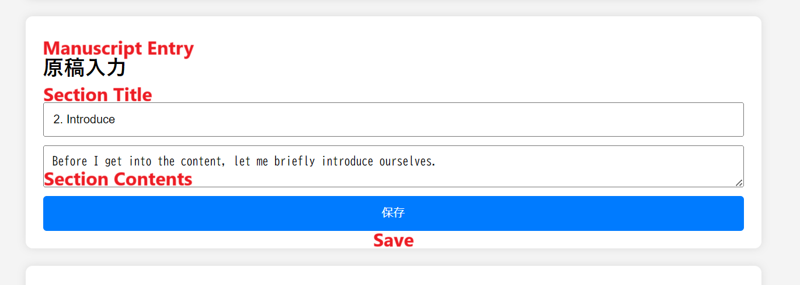

# README

Japanese version [here](https://github.com/sahara581/site/blob/main/ReadmeJp.md).

This repository contains multiple sites by me, sahara581.
The files in this repository are primarily for the creator's learning, play and practical use, and include HTML games, practical tools and more.

All files in this repository are provided under the MIT License. For more information about the license, [please click here](#chap-license).

## [Calture Festival](https://sahara581.github.io/site/CF/CultureFestivalTopPage.html)
This is a publicity and image posting site that I created for a school festival.
It was not actually used at the festival, but I learned a lot about exchanging data with the server.

## [Platformer Game](https://sahara581.github.io/site/PlatformerGame/index.html)
While I usually make games in Unity, I tried to see how well I could make games in HTML.
I never thought I could make a good game, and in fact, I couldn't.
Instead, with the support of my friends, I succeeded in making the worst game I had ever made.
Instead, with the support of my friends, I succeeded in making the worst game in my history.
#### Operate
Tap the right half of the screen : Acceleration
Tap the left half of the screen : Jump
Deceleration is not possible. When accelerated, the speed increases by a factor of 1.1.

## [Script Editor](https://sahara581.github.io/site/Script/index.html)
It is assumed to be printed upon completion. 

Enter one presenter at a time in the “発表者登録(Presenter Registration)” section and add each by clicking the “追加(Add)” button to the right. 

Enter the section title in the upper form of “原稿入力(Manuscript Entry)” and the content in the lower form, then click the “保存(Save)” button to add the section.
Recommended : 1 section per slide. 

The “データをJSONにエクスポート” button on the left side can be used to export data in Json format. Press the “ファイルを選択” button on the right to select the Json file you wish to import, and the selected Json file will be read. The data entered at that time will be lost, so it is recommended to make a backup of the data.

In the “セクション一覧,” registered sections are saved in the order in which they were registered, and the order can be changed by dragging. The orange “編集” button allows editing in the “原稿入力” form, and the red “削除” button deletes the section. In this case, it is recommended to make a backup with a Json file. From the pull-down menu, only one of the registered presenters can be selected.

The entered data is automatically saved in LocalStorage. 
When printing, the input form and buttons for each section are hidden to complete an easily visible manuscript.

## Technologies and Tools used

## License
MIT LICENSE
[LICENSE.md](../main/LICENSE)

